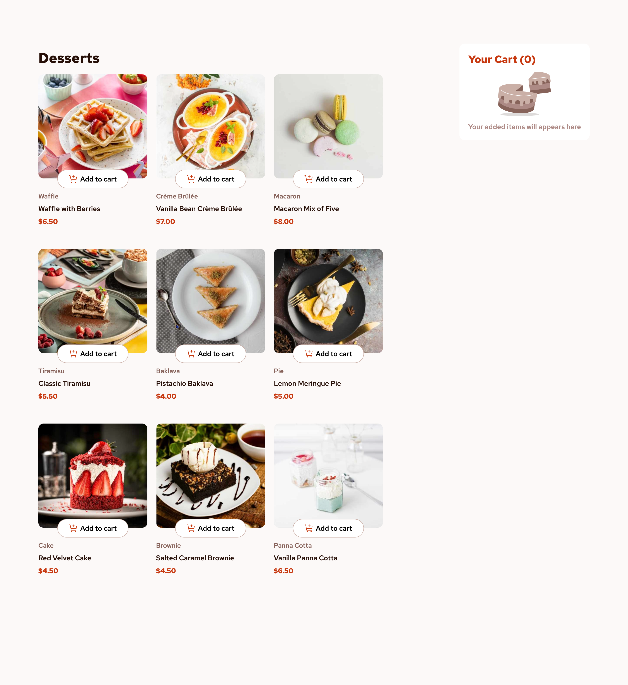
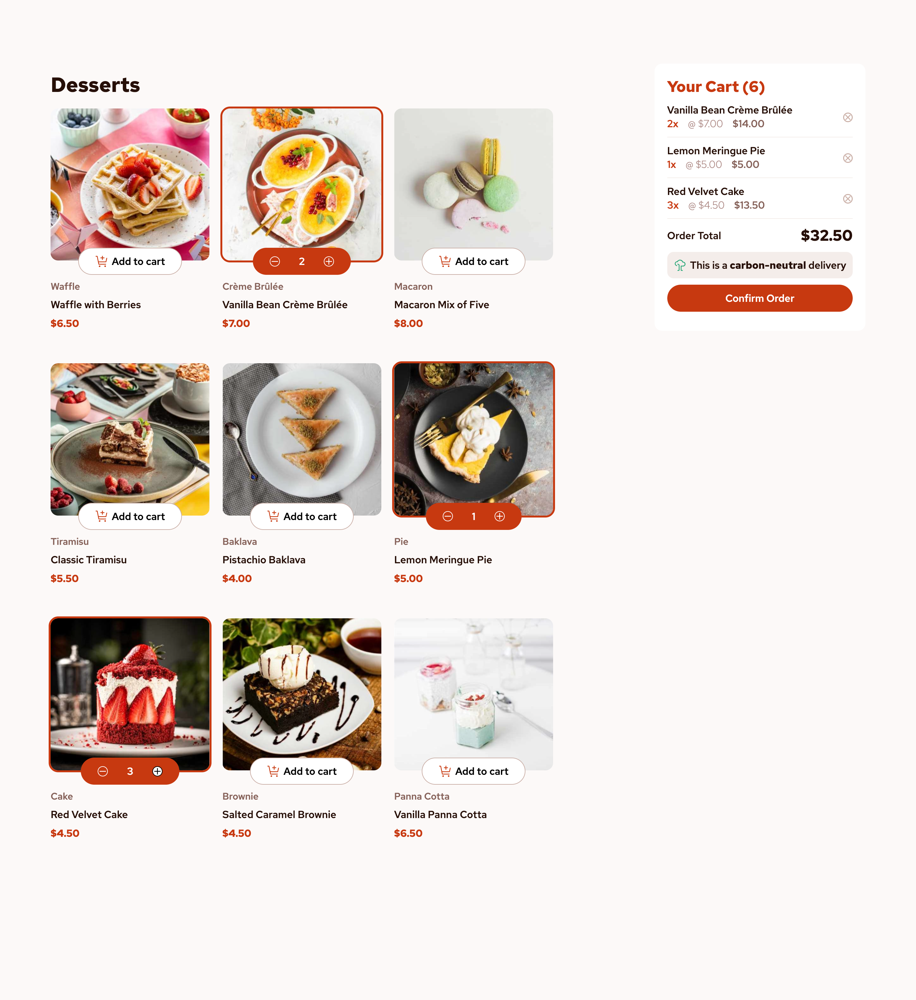
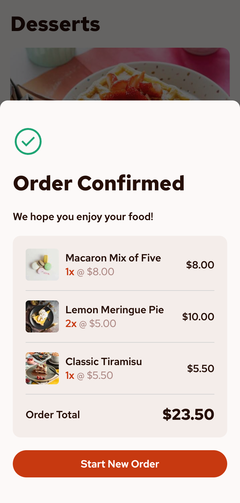

# Product list with cart solution

A responsive product list and shopping cart application built with React, Vite, and SCSS, based on a Frontend Mentor challenge.

The project focuses on clean architecture, state management with Context API, and production-ready deployment on GitHub Pages.

## Table of contents

- [Overview](#overview)
  - [The challenge](#the-challenge)
  - [Links](#links)
- [My process](#my-process)
  - [Built with](#built-with)
  - [Features](#features)
  - [What I learned](#what-i-learned)
- [Deployment (GitHub Pages)](#deployment-github-pages)
- [Screenshot solution](#screenshot-solution)

## Overview

### The challenge

Users should be able to:

- Add items to the cart and remove them
- Increase/decrease the number of items in the cart
- See an order confirmation modal when they click "Confirm Order"
- Reset their selections when they click "Start New Order"
- View the optimal layout for the interface depending on their device's screen size
- See hover and focus states for all interactive elements on the page

### Links

- Live Site URL: [https://alepacc.github.io/product-list/](https://alepacc.github.io/product-list/)

## My process

### Built with

- Semantic HTML5 markup
- SCSS custom properties
- Flexbox
- Mobile-first workflow
- [React](https://reactjs.org/) - JS library
- [Vite](https://vitejs.dev/) - Frontend build tool

### Features

- Product list rendered from a static JSON file
- Add / remove products from cart
- Quantity increment & decrement
- Cart total price calculation
- Order confirmation modal
- Responsive layout (mobile-first)

### What I learned
During this project, I practiced with React to creating reusable components and managing component state effectively.
I also improved my skills in building responsive layouts using Flexbox and SCSS.

## Deployment (GitHub Pages)

The project is deployed using Vite's base configuration:

` base: '/product-list/' `

The production build is served from the dist/ folder.

## Screenshot solution

Desktop empty page

Desktop selected items
Mobile order confirmation modal

